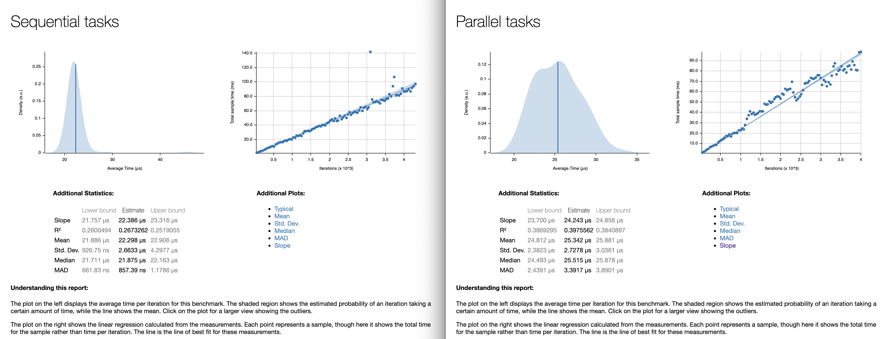

# Parallel Addition Mesh

I have been using random data for 2D Vector with n=15376 and m=15376 in Parallel
and Sequential process in Rust code. 

I have question with this title:
Have random numbers effect into Parallel and Sequential method of process speed?
How much?

Yes, the use of random numbers can have an effect on the speed of both parallel
and sequential processes. 

In a parallel process, the use of random numbers can introduce additional
overhead due to the need to synchronize the generation of random numbers across
multiple threads or processes. This can lead to slower overall performance
compared to a sequential process.

In a sequential process, the use of random numbers can also impact performance,
particularly if the random number generation is computationally expensive. This
can lead to slower overall performance compared to a sequential process that
does not use random numbers.

Additionally, the specific implementation of the random number generation
algorithm can also impact performance. Some algorithms may be more
computationally expensive than others, leading to slower performance.

Overall, the impact of random numbers on process speed will depend on the
specific implementation and context of the process. It is important to carefully
consider the use of random numbers and their potential impact on performance
when designing and implementing parallel and sequential processes.